# SAD Comparison Analysis: OpenClaw → Remy

**Version:** 1.0  
**Date:** 01/03/2026  
**Purpose:** Identify architecture patterns from OpenClaw that can enhance Remy without importing unnecessary complexity.

---

## Table of Contents

1. [Comparison Analysis](#1-comparison-analysis)
2. [Valuable Patterns to Adopt](#2-valuable-patterns-to-adopt)
3. [Implementation Suggestions](#3-implementation-suggestions)
4. [Summary of Recommendations](#4-summary-of-recommendations)
5. [Proposed Integration Architecture](#5-proposed-integration-architecture)
6. [Key Takeaways](#6-key-takeaways)

---

## 1. Comparison Analysis

### 1.1 Technology Stack Comparison


| Aspect                | OpenClaw (External)       | Remy (Personal)     | Notes                           |
| --------------------- | ------------------------- | ------------------- | ------------------------------- |
| **Language**          | TypeScript (ESM, strict)  | Python 3.12         | Different ecosystems            |
| **Runtime**           | Node.js 22+ / Bun         | Python asyncio      | Both async-capable              |
| **Bot Framework**     | grammy, @slack/bolt, etc. | python-telegram-bot | OpenClaw multi-channel          |
| **AI Client**         | Pi agent framework        | anthropic SDK       | OpenClaw uses abstraction layer |
| **Database**          | SQLite + sqlite-vec       | SQLite + sqlite-vec | **Same**                        |
| **Vector Search**     | sqlite-vec                | sqlite-vec          | **Same**                        |
| **Schema Validation** | Zod, Typebox              | Pydantic            | Similar purpose                 |
| **Build/Test**        | tsdown, Vitest            | pytest, ruff, mypy  | Language-specific               |


### 1.2 Architecture Pattern Comparison

```mermaid
graph TB
    subgraph OpenClaw_Architecture
        OC_CLI[CLI Layer]
        OC_GW[Gateway Layer]
        OC_AGENT[Agent Layer]
        OC_CHANNEL[Channel Layer]
        OC_PLUGIN[Plugin Layer]
        OC_DATA[Data Layer]
        
        OC_CLI --> OC_GW
        OC_GW --> OC_AGENT
        OC_AGENT --> OC_CHANNEL
        OC_CHANNEL --> OC_PLUGIN
        OC_PLUGIN --> OC_DATA
    end

    subgraph Remy_Architecture
        R_MAIN[Entry Layer]
        R_BOT[Bot Layer]
        R_AI[AI Layer]
        R_MEM[Memory Layer]
        R_INT[Integration Layer]
        R_INFRA[Infrastructure]
        
        R_MAIN --> R_BOT
        R_BOT --> R_AI
        R_AI --> R_MEM
        R_MEM --> R_INT
        R_INT --> R_INFRA
    end

    style OC_PLUGIN fill:#90EE90
    style OC_GW fill:#90EE90
```


### 1.3 Key Architectural Differences


| Pattern                   | OpenClaw                    | Remy                  | Gap Analysis                                                                                                         |
| ------------------------- | --------------------------- | --------------------- | -------------------------------------------------------------------------------------------------------------------- |
| **Plugin System**         | Full plugin SDK with hooks  | None                  | **Major gap (user note: plugins not required Remy is my own personal agent, I can add features directly if needed)** |
| **Channel Abstraction**   | Unified adapter interface   | Telegram-only         | Not needed for single-user (user note: agreed)                                                                       |
| **Gateway/Control Plane** | WebSocket RPC server        | None                  | Potential enhancement (user note: explain pros and cons)                                                             |
| **Lifecycle Hooks**       | 18+ hook points             | None                  | **Valuable pattern (user note: implement)**                                                                          |
| **Write-ahead Queue**     | Crash-recovery delivery     | None                  | **Valuable pattern (user note: implement**                                                                           |
| **Auth Profiles**         | Multi-provider key rotation | Circuit breakers only | Partial coverage (user note: implement key rotation)                                                                 |
| **Session Compaction**    | Built-in with hooks         | Manual only           | **Enhancement opportunity (user note: implement)**                                                                   |
| **Config Audit**          | JSONL audit log             | None                  | **Valuable pattern (user note: implement)**                                                                          |


### 1.4 Module Comparison


| Domain       | OpenClaw Modules              | Remy Modules             | Comparison                                                                     |
| ------------ | ----------------------------- | ------------------------ | ------------------------------------------------------------------------------ |
| **Entry**    | `cli/`, `commands/`           | `main.py`                | OpenClaw has CLI framework                                                     |
| **Gateway**  | `gateway/` (199 files)        | None                     | OpenClaw has control plane                                                     |
| **Agent**    | `agents/` (456 files)         | `ai/`, `agents/`         | Similar purpose, different scale                                               |
| **Channels** | `telegram/`, `discord/`, etc. | `bot/`                   | OpenClaw multi-channel                                                         |
| **Memory**   | `memory/`                     | `memory/`                | **Similar**                                                                    |
| **Plugins**  | `plugins/`, `hooks/`          | None                     | **Gap (User Note: see above, plugins not necessary, but hooks are desirable)** |
| **Config**   | `config/` (181 files)         | `config.py`              | OpenClaw more elaborate                                                        |
| **Media**    | `media/`                      | `voice/`                 | OpenClaw broader media support (user note: additional media low priority P3)   |
| **Infra**    | `infra/` (275 files)          | `utils/`, `diagnostics/` | OpenClaw more comprehensive (user note: what can we take, what's worth it?)    |


---

## 2. Valuable Patterns to Adopt

### 2.1 Hook/Lifecycle System

OpenClaw's hook system provides extensibility at 18+ points without modifying core code.

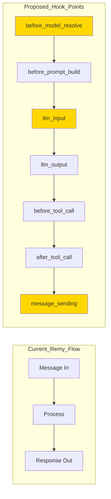


**OpenClaw Hook Points (Appendix B):**


| Hook                   | Trigger Point                  |
| ---------------------- | ------------------------------ |
| `before_model_resolve` | Before selecting AI model      |
| `before_prompt_build`  | Before constructing prompt     |
| `before_agent_start`   | Before agent begins processing |
| `llm_input`            | Before LLM API call            |
| `llm_output`           | After LLM response             |
| `agent_end`            | After agent completes          |
| `before_compaction`    | Before session compaction      |
| `after_compaction`     | After session compaction       |
| `message_received`     | When message arrives           |
| `message_sending`      | Before message sent            |
| `message_sent`         | After message delivered        |
| `before_tool_call`     | Before tool execution          |
| `after_tool_call`      | After tool execution           |
| `session_start`        | When session begins            |
| `session_end`          | When session ends              |
| `gateway_start`        | When gateway starts            |
| `gateway_stop`         | When gateway stops             |


**Benefit:** Enables logging, metrics, transformations, and debugging without touching core handlers.  
  
(user note: accept)

### 2.2 Write-Ahead Queue for Message Delivery

OpenClaw uses a write-ahead queue for crash recovery on outbound messages.

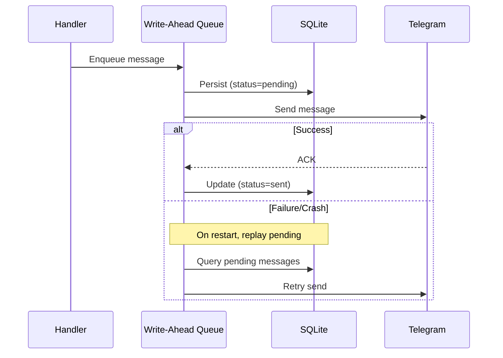


**Benefit:** Prevents message loss during crashes or network failures.  
  
(user note: accept)

### 2.3 Configuration Audit Trail

OpenClaw logs all configuration changes to `config-audit.jsonl`.

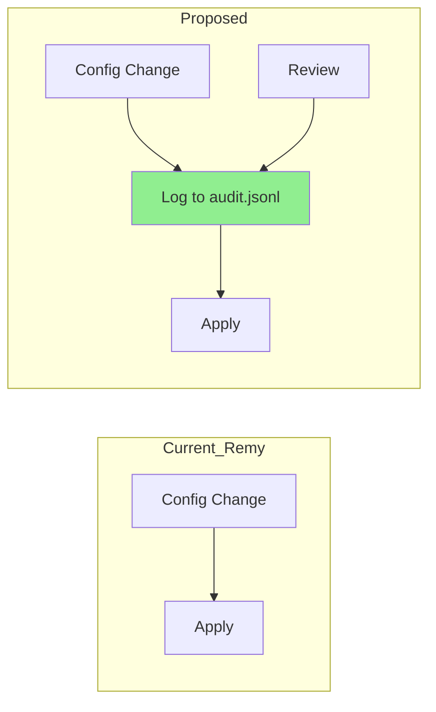


**Benefit:** Debugging, rollback capability, compliance tracking.  
  
(user note: accept)

### 2.4 Session Compaction with Hooks

OpenClaw provides `before_compaction` and `after_compaction` hooks for session management.

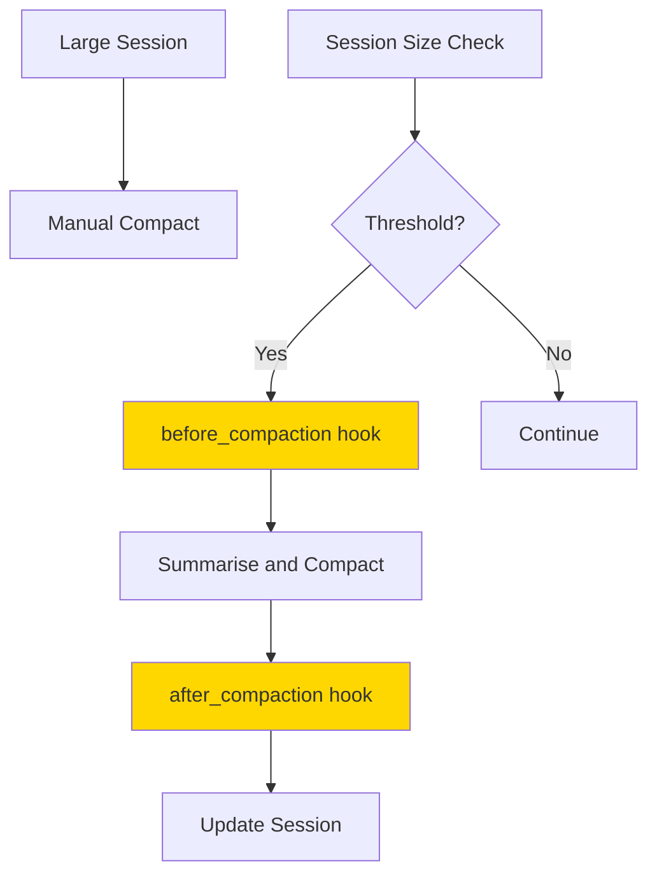


**Benefit:** Automatic context management, cost control, extensible compaction logic.  
  
(user note: accept)

### 2.5 Structured Gateway Health/Diagnostics

OpenClaw's `openclaw doctor` command provides comprehensive diagnostics.

```mermaid
graph TB
    subgraph Current_Remy_Health
        H1[/health]
        H2[status: ok]
        H3[/ready]
        H4[status: ready]
        H5[/metrics]
        H6[Prometheus]
        
        H1 --> H2
        H3 --> H4
        H5 --> H6
    end

    subgraph Proposed_Diagnostics
        D1[/diagnostics]
        D2[API Connectivity]
        D3[Database Health]
        D4[Memory Stats]
        D5[Circuit Breaker States]
        D6[Queue Depth]
        D7[Recent Errors]
        
        D1 --> D2
        D1 --> D3
        D1 --> D4
        D1 --> D5
        D1 --> D6
        D1 --> D7
    end

    style D1 fill:#90EE90
```


**Benefit:** Single endpoint for troubleshooting, proactive monitoring.  
  
(user note: we have Remy self diagnosis perform a detailed comparison and improve remy self diagnosis as needed)

---

## 3. Implementation Suggestions  
  
(user note: accept suggestions)

### 3.1 Summary Table


| Pattern/Capability        | OpenClaw Module   | Remy Module                    | Suggested Adaptation              | Benefit                           | Priority |
| ------------------------- | ----------------- | ------------------------------ | --------------------------------- | --------------------------------- | -------- |
| **Lifecycle Hooks**       | `src/hooks/`      | New: `remy/hooks/`             | Event emitter with typed hooks    | Extensibility, debugging, metrics | High     |
| **Write-Ahead Queue**     | `src/gateway/`    | New: `remy/delivery/queue.py`  | SQLite-backed outbound queue      | Crash recovery, reliability       | High     |
| **Config Audit**          | `src/config/`     | `remy/config.py`               | JSONL audit log on changes        | Debugging, rollback               | Medium   |
| **Auto-Compaction**       | `src/agents/`     | `remy/memory/conversations.py` | Threshold-triggered summarisation | Cost control, context management  | Medium   |
| **Diagnostics Endpoint**  | `src/cli/doctor/` | `remy/health.py`               | Extended `/diagnostics` JSON      | Troubleshooting                   | Medium   |
| **Binding-based Routing** | `src/routing/`    | Not applicable                 | Skip — single-channel             | N/A                               | Skip     |
| **Plugin SDK**            | `src/plugin-sdk/` | Not applicable                 | Skip — over-engineering           | N/A                               | Skip     |
| **Multi-Channel**         | `extensions/`*    | Not applicable                 | Skip — Telegram-only              | N/A                               | Skip     |


### 3.2 Detailed Implementation: Lifecycle Hooks

**New module:** `remy/hooks/lifecycle.py`

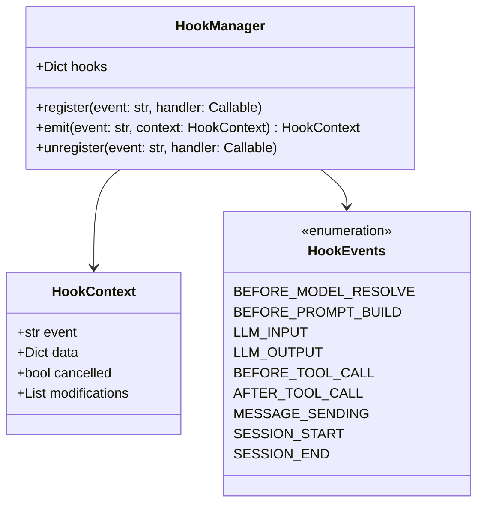


**Integration into existing flow:**

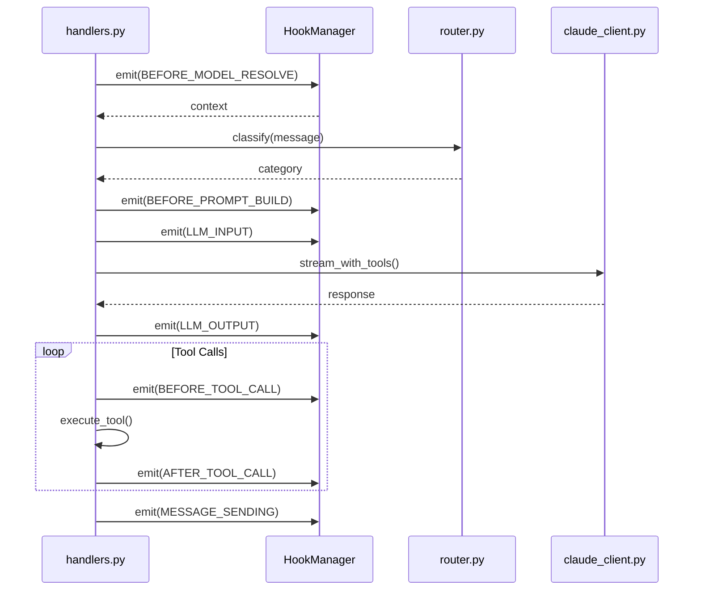


**Example usage:**

```python
from remy.hooks.lifecycle import hook_manager, HookEvents

@hook_manager.on(HookEvents.LLM_OUTPUT)
async def log_token_usage(context: HookContext) -> HookContext:
    logger.info(
        "LLM response",
        extra={
            "input_tokens": context.data["input_tokens"],
            "output_tokens": context.data["output_tokens"],
            "cache_hit": context.data.get("cache_read_tokens", 0) > 0,
        }
    )
    return context

@hook_manager.on(HookEvents.BEFORE_TOOL_CALL)
async def audit_sensitive_tools(context: HookContext) -> HookContext:
    if context.data["tool"] in ["write_file", "create_email_draft"]:
        logger.warning(f"Sensitive tool: {context.data['tool']}")
    return context
```

### 3.3 Detailed Implementation: Write-Ahead Queue

**New module:** `remy/delivery/queue.py`

**Schema:**

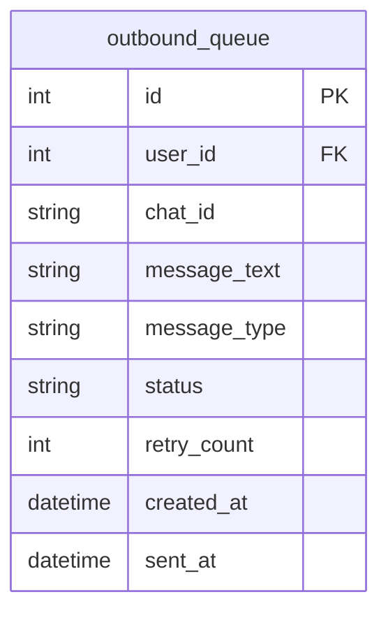


**State Machine:**

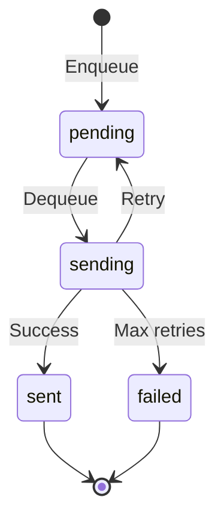


**Interface:**

```python
class OutboundQueue:
    async def enqueue(self, chat_id: str, message: str, msg_type: str = "text") -> int:
        """Persist message before sending."""

    async def process_pending(self) -> None:
        """Background task to process queue."""

    async def mark_sent(self, queue_id: int) -> None:
        """Mark message as successfully sent."""

    async def replay_on_startup(self) -> None:
        """Replay pending messages after crash/restart."""
```

### 3.4 Detailed Implementation: Diagnostics Endpoint

**Enhanced `remy/health.py`:**

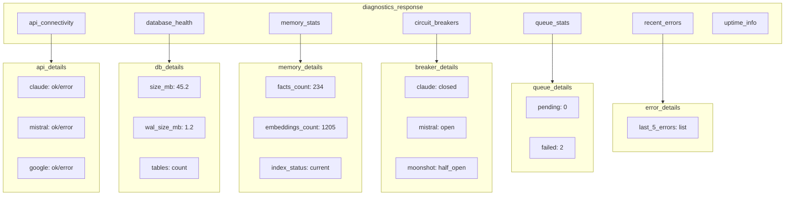


**Example response:**

```json
{
  "status": "healthy",
  "timestamp": "2026-03-01T10:30:00+11:00",
  "uptime_seconds": 86400,
  "api_connectivity": {
    "claude": {"status": "ok", "latency_ms": 245},
    "mistral": {"status": "ok", "latency_ms": 180},
    "google_calendar": {"status": "ok"},
    "google_gmail": {"status": "ok"}
  },
  "database": {
    "size_mb": 45.2,
    "wal_size_mb": 1.2,
    "facts_count": 234,
    "embeddings_count": 1205
  },
  "circuit_breakers": {
    "claude": "closed",
    "mistral": "closed",
    "moonshot": "open"
  },
  "outbound_queue": {
    "pending": 0,
    "failed": 2
  },
  "recent_errors": []
}
```

### 3.5 Detailed Implementation: Auto-Compaction

**Enhanced `remy/memory/conversations.py`:**

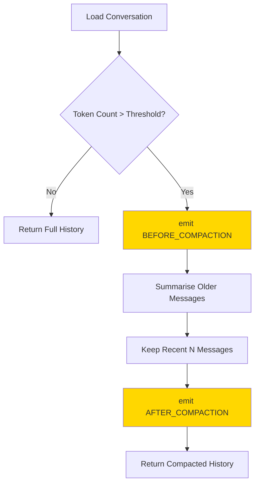


**Configuration:**

```python
class CompactionConfig(BaseModel):
    enabled: bool = True
    token_threshold: int = 50_000
    keep_recent_messages: int = 20
    summary_model: str = "claude-haiku-4-5-20251001"
```

### 3.6 Detailed Implementation: Config Audit

**New file:** `data/config-audit.jsonl`

**Format:**

```json
{"timestamp": "2026-03-01T10:30:00+11:00", "action": "update", "key": "MODEL_COMPLEX", "old_value": "claude-sonnet-4-20250514", "new_value": "claude-sonnet-4-6", "source": "env"}
{"timestamp": "2026-03-01T11:00:00+11:00", "action": "update", "key": "BRIEFING_CRON", "old_value": "0 7 * * *", "new_value": "0 6 * * *", "source": "runtime"}
```

**Implementation:**

```python
import json
from datetime import datetime
from pathlib import Path

class ConfigAuditor:
    def __init__(self, audit_path: Path):
        self.audit_path = audit_path
    
    def log_change(self, key: str, old_value: any, new_value: any, source: str = "runtime"):
        entry = {
            "timestamp": datetime.now().isoformat(),
            "action": "update",
            "key": key,
            "old_value": str(old_value) if old_value else None,
            "new_value": str(new_value),
            "source": source,
        }
        with open(self.audit_path, "a") as f:
            f.write(json.dumps(entry) + "\n")
```

---

## 4. Summary of Recommendations

### 4.1 Adopt (High Value, Low Complexity)


| #   | Pattern                  | Effort | Impact | Rationale                                                                 |
| --- | ------------------------ | ------ | ------ | ------------------------------------------------------------------------- |
| 1   | **Lifecycle Hooks**      | Medium | High   | Enables debugging, metrics, and extensibility without modifying core code |
| 2   | **Write-Ahead Queue**    | Medium | High   | Prevents message loss, improves reliability                               |
| 3   | **Config Audit Trail**   | Low    | Medium | Simple JSONL append, valuable for debugging                               |
| 4   | **Diagnostics Endpoint** | Low    | Medium | Single troubleshooting endpoint                                           |


### 4.2 Consider (Medium Value, Medium Complexity)


| #   | Pattern                   | Effort | Impact | Rationale                                           |
| --- | ------------------------- | ------ | ------ | --------------------------------------------------- |
| 5   | **Auto-Compaction**       | Medium | Medium | Already have manual; hooks make it extensible       |
| 6   | **Auth Profile Rotation** | Medium | Medium | Remy has circuit breakers; rotation adds redundancy |


### 4.3 Skip (Not Applicable to Single-User)


| #   | Pattern               | Reason to Skip                                                |
| --- | --------------------- | ------------------------------------------------------------- |
| 1   | Plugin SDK            | Over-engineering for single-user; direct code changes suffice |
| 2   | Multi-Channel Support | Telegram-only by design                                       |
| 3   | Binding-based Routing | No multi-user routing needed                                  |
| 4   | Gateway WebSocket     | No native apps or multi-device control plane needed           |
| 5   | Device Pairing        | Single-user allowlist is sufficient                           |


### 4.4 Implementation Priority

```
Priority 1 (Immediate):
├── Lifecycle Hooks
└── Write-Ahead Queue

Priority 2 (Next Sprint):
├── Config Audit Trail
└── Diagnostics Endpoint

Priority 3 (Backlog):
├── Auto-Compaction with Hooks
└── Auth Profile Rotation
```

---

(user note: agreed)

## 5. Proposed Integration Architecture

```mermaid
graph TB
    subgraph Entry_Layer
        Main[main.py]
        TGBot[telegram_bot.py]
    end

    subgraph Hook_Layer
        HookMgr[HookManager]
        Hooks[Registered Hooks]
    end

    subgraph Bot_Layer
        Handlers[handlers.py]
        Session[session.py]
        Streaming[streaming.py]
    end

    subgraph AI_Layer
        Router[router.py]
        Claude[claude_client.py]
        Tools[tool_registry.py]
    end

    subgraph Memory_Layer
        Database[database.py]
        Embeddings[embeddings.py]
        Conversations[conversations.py]
        AutoCompact[auto_compaction.py]
    end

    subgraph Delivery_Layer
        Queue[OutboundQueue]
        QueueProcessor[Background Processor]
    end

    subgraph Infrastructure_Layer
        Config[config.py]
        ConfigAudit[config_audit.jsonl]
        Health[health.py]
        Diagnostics[/diagnostics]
    end

    Main --> TGBot
    Main --> HookMgr
    TGBot --> Handlers

    Handlers --> HookMgr
    HookMgr --> Hooks

    Handlers --> Router
    Router --> Claude
    Claude --> Tools

    Handlers --> Conversations
    Conversations --> AutoCompact
    AutoCompact --> HookMgr

    Handlers --> Queue
    Queue --> QueueProcessor
    QueueProcessor --> TGBot

    Config --> ConfigAudit
    Health --> Diagnostics

    style HookMgr fill:#90EE90
    style Queue fill:#90EE90
    style ConfigAudit fill:#90EE90
    style Diagnostics fill:#90EE90
    style AutoCompact fill:#90EE90
```


### 5.1 Data Flow with New Components

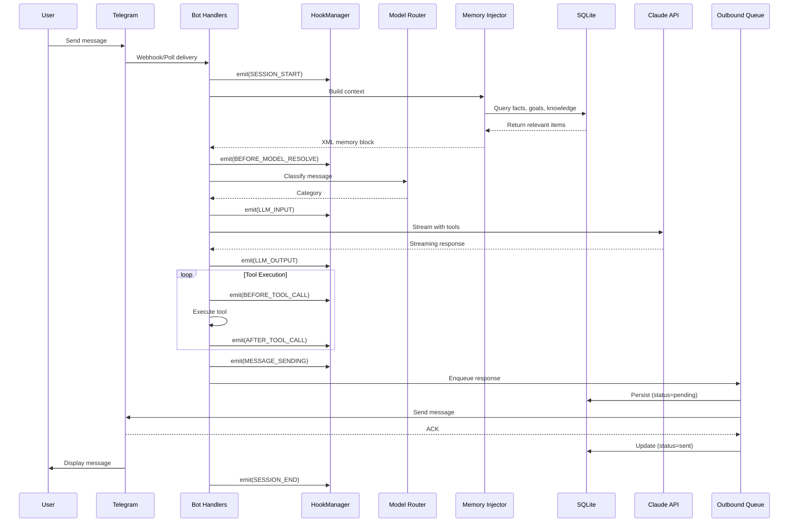


---

## 6. Key Takeaways

### 6.1 Primary Insights

1. **Hooks are the highest-value pattern** — They provide extensibility, debugging, and metrics without touching core code. OpenClaw's 18+ hook points demonstrate mature thinking about lifecycle management.
2. **Write-ahead queue improves reliability** — For a personal assistant, losing a message during a crash is frustrating. The queue pattern is simple to implement with SQLite.
3. **Diagnostics consolidation saves time** — Instead of checking multiple endpoints and logs, a single `/diagnostics` endpoint provides a complete system health snapshot.
4. **Skip multi-user patterns** — Plugin SDK, multi-channel, binding-based routing, and device pairing are unnecessary complexity for a single-user Telegram bot.
5. **Config audit is low-hanging fruit** — A simple JSONL append on config changes provides valuable debugging capability with minimal effort.

### 6.2 Recommended Adoption Order

```
1. Lifecycle Hooks
   └── Foundation for all other enhancements

2. Write-Ahead Queue
   └── Reliability improvement

3. Config Audit Trail
   └── Low effort, immediate value

4. Diagnostics Endpoint
   └── Operational visibility

5. Auto-Compaction with Hooks
   └── Cost optimisation
```

### 6.3 Patterns Explicitly Not Adopted


| Pattern                   | OpenClaw Implementation        | Reason to Skip                     |
| ------------------------- | ------------------------------ | ---------------------------------- |
| **Plugin SDK**            | Full SDK with registration API | Over-engineering for single-user   |
| **Multi-Channel**         | 32 channel extensions          | Telegram-only by design            |
| **Gateway WebSocket**     | Real-time control plane        | No native apps needed              |
| **Binding-based Routing** | Multi-tier message routing     | Single-user, single-channel        |
| **Device Pairing**        | Challenge/response allowlist   | Telegram user allowlist sufficient |
| **Native Apps**           | macOS, iOS, Android            | Telegram client sufficient         |
| **Web Control UI**        | Lit/Vite dashboard             | Not needed for personal use        |


### 6.4 Estimated Effort


| Enhancement          | New Files | Modified Files | Effort   |
| -------------------- | --------- | -------------- | -------- |
| Lifecycle Hooks      | 2         | 3-4            | 2-3 days |
| Write-Ahead Queue    | 1         | 2              | 1-2 days |
| Config Audit         | 1         | 1              | 0.5 days |
| Diagnostics Endpoint | 0         | 1              | 0.5 days |
| Auto-Compaction      | 1         | 1              | 1 day    |


**Total estimated effort:** 5-7 days

---

## Appendix A: OpenClaw Extension List (Reference)


| Extension          | Type    | Description                  |
| ------------------ | ------- | ---------------------------- |
| `telegram`         | Channel | Telegram bot integration     |
| `discord`          | Channel | Discord bot integration      |
| `slack`            | Channel | Slack app integration        |
| `whatsapp`         | Channel | WhatsApp Web integration     |
| `signal`           | Channel | Signal messenger integration |
| `imessage`         | Channel | iMessage integration         |
| `matrix`           | Channel | Matrix protocol integration  |
| `msteams`          | Channel | Microsoft Teams integration  |
| `googlechat`       | Channel | Google Chat integration      |
| `line`             | Channel | LINE messenger integration   |
| `memory-core`      | Utility | Memory system core           |
| `memory-lancedb`   | Utility | LanceDB vector store         |
| `diagnostics-otel` | Utility | OpenTelemetry diagnostics    |


---

## Appendix B: Remy Tool Registry (Current State)


| Category      | Tools                                                                                                                                                               |
| ------------- | ------------------------------------------------------------------------------------------------------------------------------------------------------------------- |
| **Time**      | `get_current_time`                                                                                                                                                  |
| **Memory**    | `get_logs`, `get_goals`, `get_facts`, `manage_memory`, `manage_goal`, `get_memory_summary`                                                                          |
| **Analysis**  | `run_board`, `check_status`                                                                                                                                         |
| **Calendar**  | `calendar_events`, `create_calendar_event`                                                                                                                          |
| **Gmail**     | `read_emails`, `search_gmail`, `read_email`, `list_gmail_labels`, `label_emails`, `create_gmail_label`, `create_email_draft`, `classify_promotional_emails`         |
| **Contacts**  | `search_contacts`, `upcoming_birthdays`, `get_contact_details`, `update_contact_note`, `find_sparse_contacts`                                                       |
| **Web**       | `web_search`, `price_check`                                                                                                                                         |
| **Files**     | `read_file`, `list_directory`, `write_file`, `append_file`, `find_files`, `scan_downloads`, `organize_directory`, `clean_directory`, `search_files`, `index_status` |
| **Documents** | `read_gdoc`, `append_to_gdoc`                                                                                                                                       |
| **Shopping**  | `grocery_list`                                                                                                                                                      |
| **Reminders** | `schedule_reminder`, `set_one_time_reminder`, `list_reminders`, `remove_reminder`, `breakdown_task`                                                                 |
| **Plans**     | `create_plan`, `get_plan`, `list_plans`, `update_plan_step`, `update_plan_status`                                                                                   |
| **Analytics** | `get_stats`, `get_goal_status`, `generate_retrospective`, `get_costs`, `consolidate_memory`, `list_background_jobs`                                                 |
| **Session**   | `compact_conversation`, `delete_conversation`, `set_proactive_chat`                                                                                                 |


---

*Document generated: 01/03/2026*  
*Source comparison: OpenClaw SAD v1.0 vs Remy SAD v1.0*