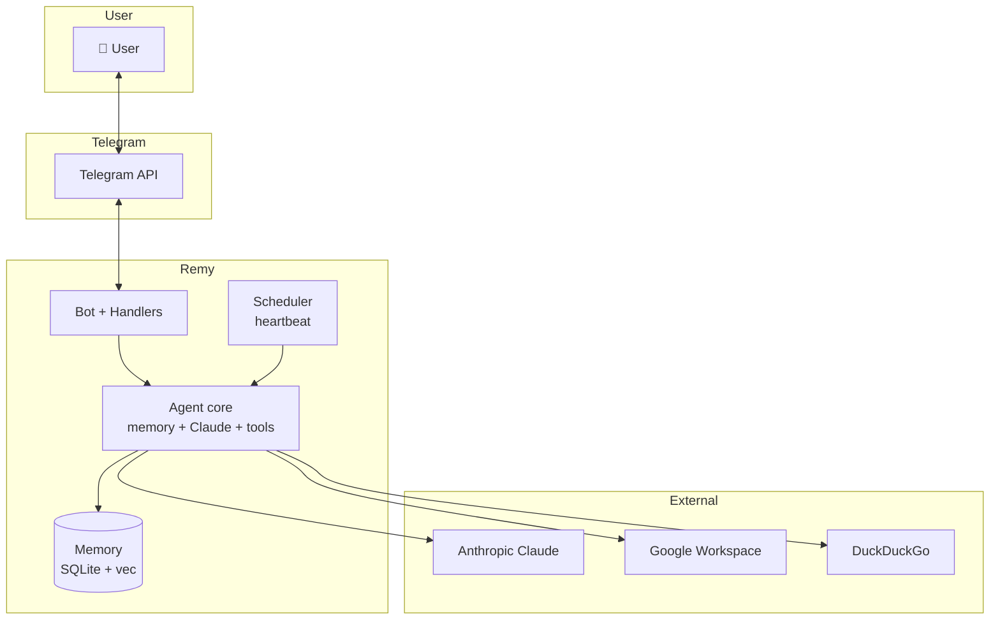

# Remy — Concept Design Document

**Version:** 1.0  
**Date:** 10/03/2026  
**Status:** Living document  

Concise concept design: vision, problem, users, features, UI, architecture, scope, and non-goals. Australian English; DD/MM/YYYY.

---

## 1. Executive summary / vision

**Remy** is a personal AI assistant that lives in Telegram and acts as a single-user “chief of staff”: it handles tasks, tracks goals, reads email, manages calendar, remembers context across conversations, and sends timely briefings—without spamming. It uses Claude (Anthropic) with native tool use, structured memory (SQLite + vector search), and an evaluative heartbeat so proactivity is context-aware, not clock-driven.

**Target audience:** One primary user (the owner) who wants a capable, trustworthy assistant that respects attention and works across the day from a single chat.

**Core value:** One place (Telegram) to ask anything, delegate triage and follow-ups, and get proactive nudge when it matters—backed by memory, goals, and integrations (Gmail, Calendar, Contacts, files, web).

---

## 2. Problem statement & objectives

### 2.1 Problem

- **Inbox and calendar overload** without a single, intelligent triage and summary point.
- **Goals and plans** that slip because there’s no persistent, conversational memory and no gentle nudge when things stall.
- **Context loss** across sessions and tools (Telegram vs IDE vs desktop) so the assistant doesn’t feel like “one” agent.
- **Proactive assistants** that either spam at fixed times or never reach out—no middle ground.

### 2.2 Objectives (SMART)

| Objective | Measurable | Target |
|-----------|------------|--------|
| **O1** | User can complete calendar, email, and goal queries via natural language in Telegram | 100% of supported query types handled by tools |
| **O2** | Proactive contact only when HEARTBEAT thresholds say so | HEARTBEAT_OK rate &gt; ~80% of heartbeat runs (no message sent) |
| **O3** | Conversation and memory persist across sessions | Session JSONL + SQLite knowledge; no manual “remember this” for facts/goals |
| **O4** | Single-user deployment runs reliably on a Mac Mini (or similar) | Docker Compose; health endpoint; optional Cloudflare Tunnel |

---

## 3. Target user personas & journeys

### 3.1 Primary persona: Dale (owner)

- **Role:** Sole user; uses Telegram daily; also uses Cursor and Claude Desktop.
- **Goals:** Reduce cognitive load, keep goals/plans visible, get briefings and check-ins that feel useful, not noisy.
- **Frustrations:** Generic reminders, assistants that forget context, and tools that don’t talk to each other.

### 3.2 Key user journeys (high level)

```text
1. Morning: User opens Telegram → sees proactive briefing (if heartbeat decided to send) → asks follow-up (“move 3pm to 4pm”) → Remy uses calendar tool → confirms.
2. Triage: “Label last 20 LinkedIn emails as read and archive” → Remy uses Gmail tools → reports count; approval gate if bulk.
3. Goal check: “What’s the status of my certification plan?” → Remy reads goals/plans from memory → summarises steps and suggests next action.
4. Evening: Heartbeat runs → no threshold crossed → HEARTBEAT_OK (no message). Next run: overdue goal → Remy sends short nudge with goal name and optional button.
```

---

## 4. Core features & functionality

### 4.1 Essential features

| Feature | Description | User story (example) |
|---------|-------------|----------------------|
| **Conversational chat** | NLU + tool use in Telegram (text, voice, photo) | “What’s on my calendar tomorrow?” → calendar_events |
| **Memory** | Facts, goals, plans, conversation history; semantic search | “Remember I prefer morning meetings” → stored; later injected in context |
| **Calendar** | Read and create events (Google Calendar) | “Add lunch with Alex Friday 12:30” |
| **Email** | Read, search, label, archive, drafts (Gmail) | “Label all from newsletter@ as Promo and archive” |
| **Contacts** | Search, birthdays, notes (Google People) | “When is Sarah’s birthday?” |
| **Goals & plans** | Create/update goals and multi-step plans; track status | “Add step 3 to plan ‘Certification’: take practice exam” |
| **Reminders & automations** | One-time and recurring reminders; approval gates for bulk | “Remind me to call Mum Saturday 10am” |
| **Proactive heartbeat** | HEARTBEAT.md-driven evaluation; contact only when thresholds say so | Morning orientation, end-of-day reflection, wellbeing check-in (configurable) |
| **Board of Directors** | Multi-perspective analysis (strategy, content, finance, researcher, critic) | “Run board on: should I take the Sydney role?” |
| **Web search & research** | DuckDuckGo search; synthesis | “Search for best practices for X and summarise” |
| **Files & RAG** | Read/write/list files; index PDF/DOCX for semantic search | “Find the contract we signed in March” |
| **Health & diagnostics** | /health, /ready, /metrics, /diagnostics; self-diagnostics trigger phrase | “Are you there God, it’s me, Dale” → status + logs |

### 4.2 Constraints

- **Single user:** One Telegram allowlist.
- **Tool-use only for primary path:** Claude with native tools; no multi-provider routing on main path (see SAD).
- **Approval gates:** Bulk or destructive actions (e.g. trash &gt;10 emails) require explicit confirmation (task or Telegram button).
- **Autonomous coding:** Claude Code CLI subprocess from Remy for coding tasks (see remy-sad-v10 §10).

### 4.3 Error handling (principle)

- **User-facing:** Short, clear message; no stack traces.
- **Logging:** Full detail server-side; redact secrets.
- **Degradation:** Ollama fallback when configured; heartbeat can skip or simplify steps on failure; outbound queue for crash-safe delivery.

---

## 5. User interface & interaction design

### 5.1 Primary UI: Telegram

- **Input:** Text, voice (transcribed), photos (described). Slash commands for power users (e.g. `/board`, `/status`, `/compact`).
- **Output:** Streamed text; Markdown where supported; inline keyboards for confirm/cancel, snooze, or quick actions (e.g. “Open calendar”).
- **Feedback:** Typing/working indicator during tool use; placeholder “_Working…_” for long runs; edit-in-place when result is ready.
- **Proactive:** Same pattern for all proactive messages: contextual message + zero or more action buttons (consistent factory).

### 5.2 Key “screens” (conversation patterns)

| Pattern | Trigger | User sees |
|--------|--------|-----------|
| **Quick reply** | Short question | Streamed answer; no placeholder |
| **Tool-heavy** | “What’s on my calendar?” | Optional “Checking calendar…” then streamed summary |
| **Long-running** | “Run board on X” | “_Starting Board…_” → new message with report when done |
| **Approval** | “Trash 50 emails from X” | Message with count + Confirm / Cancel buttons |
| **Proactive** | Heartbeat threshold fired | One message (e.g. morning briefing or goal nudge) + optional buttons |
| **Self-diagnostics** | Trigger phrase | Status + recent logs (no Claude call) |

### 5.3 Design principles (UI)

- **Conversation first:** Commands are shortcuts; natural language is the main interface.
- **Minimal noise:** No message unless needed (heartbeat suppresses HEARTBEAT_OK).
- **Transparency:** User can ask for status, logs, costs; approval gates are explicit.
- **Consistency:** Same feedback and button patterns for all proactive and approval flows.

---

## 6. High-level architecture

See [HLD.md](HLD.md) and [remy-SAD.md](remy-SAD.md) for full detail. Conceptual diagram:



**Data flow:** Telegram → Bot → session + memory injection → Claude (tools) → tool executions (Gmail, Calendar, etc.) → stream back to Telegram. Proactive: Scheduler runs heartbeat → if not HEARTBEAT_OK → Core runs with proactive prompt → message to user.

**Third-party APIs:** Anthropic (primary), Google (Calendar, Gmail, People, Docs), DuckDuckGo (search). Optional: Ollama (local fallback).

---

## 7. Design principles & style guide

### 7.1 Product principles

- **Single-user, high-trust:** Optimised for one owner; no multi-tenant or generic “user” tone.
- **Config as behaviour:** SOUL.md, HEARTBEAT.md, TASK.md (and skills) are plain Markdown; behaviour changes via config, not only code.
- **Observability:** Health, metrics, logs, diagnostics; optional remote access via Cloudflare Tunnel.
- **Graceful degradation:** Missing HEARTBEAT.md → use example; missing Google token → calendar/email tools fail clearly; circuit breakers and fallbacks where appropriate.

### 7.2 “Style” (Telegram and voice)

- **Tone:** Aligned with SOUL.md—warm, concise, respectful of attention; no corporate or robotic phrasing.
- **Formatting:** Markdown where supported; lists and short paragraphs; no walls of text.
- **Branding:** Remy is the agent name; no separate “product” branding beyond the bot name and personality in SOUL.

(No separate colour/typography guide—Telegram controls client appearance; bot uses standard Markdown and buttons.)

---

## 8. Project scope & timeline

### 8.1 MVP (current state)

- Telegram bot + Claude + 60+ tools (calendar, email, contacts, files, web, goals, plans, reminders, board).
- Memory: SQLite + sqlite-vec; conversation JSONL; knowledge/facts/goals/plans.
- Proactive: Evaluative heartbeat (HEARTBEAT.md); morning/evening/wellbeing thresholds.
- Delivery: Crash-safe outbound queue; health/diagnostics/telemetry endpoints.
- Deployment: Docker Compose (remy + ollama); optional Cloudflare Tunnel.

### 8.2 Milestones (high level)

| Milestone | Content |
|-----------|---------|
| **M1 — Stable MVP** | Current feature set; consolidation and refactor (see consolidation-review); reduce command surface and wiring complexity. |
| **M2 — Reliability** | Lifecycle hooks; compaction safety; config audit; full Claude path through ClaudeClient; Google circuit breakers. |
| **M3 — Sub-agents & skills** | TaskOrchestrator/TaskRunner or simplified equivalent; skills system (config-driven); Claude Code CLI tool for autonomous coding. |
| **M4 — Polish** | Consistent proactive UX; lazy init; structured observability; integration tests for agent loop. |

Timeline is iterative; no fixed ship dates. Prioritise correctness and maintainability over new features.

### 8.3 Non-goals (explicit)

- **Multi-user or multi-tenant:** Single user only.
- **Multi-channel (Slack, Discord, web UI):** Telegram only by design.
- **Plugin SDK or third-party extensions:** Not in scope.
- **Replacing Cursor/IDE:** Cursor is review and continuation interface; Remy does not replace it.
- **General-purpose agent platform:** Remy is an agent, not infrastructure for many agents.
- **Full HA / horizontal scaling:** Single instance, SQLite; vertical scaling and reliability improvements only.

---

## 9. Living document & collaboration

- **Keep it concise:** This doc stays short; detail lives in SAD, HLD, and backlog.
- **Use visuals:** Diagrams in HLD and SAD; journey and flow above.
- **Iterate:** Update when scope or architecture shifts; link from docs/README.md.
- **Non-goals:** Revisit §8.3 when considering new work to avoid scope creep.

---

*End of concept design.*
