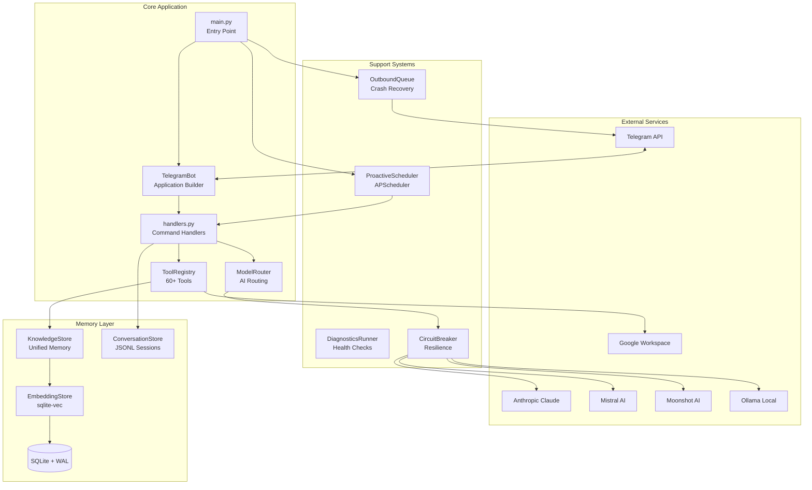
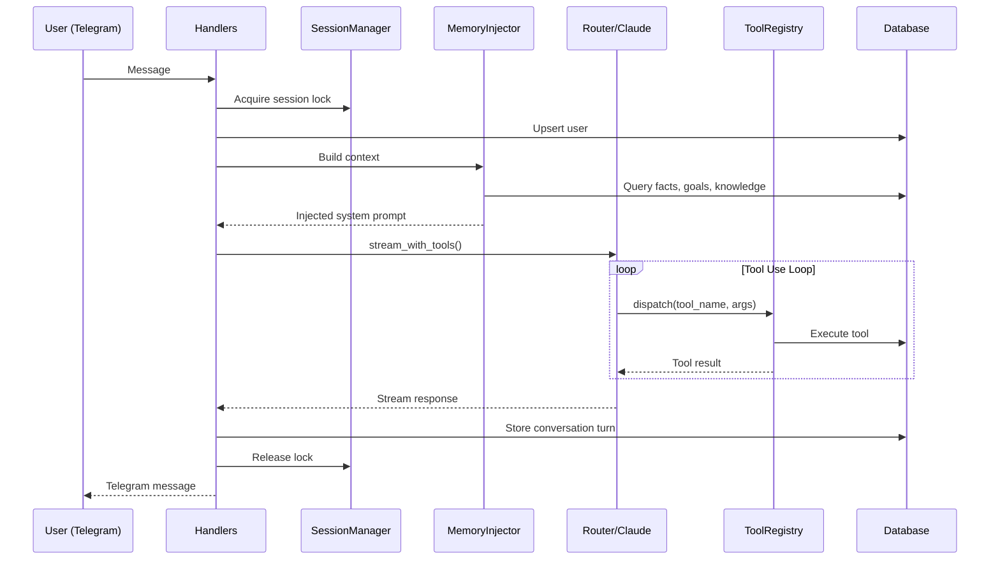
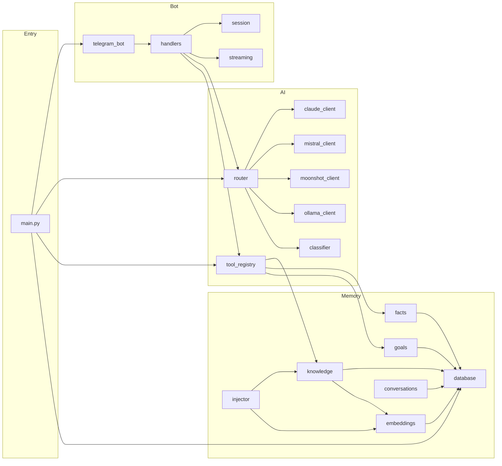
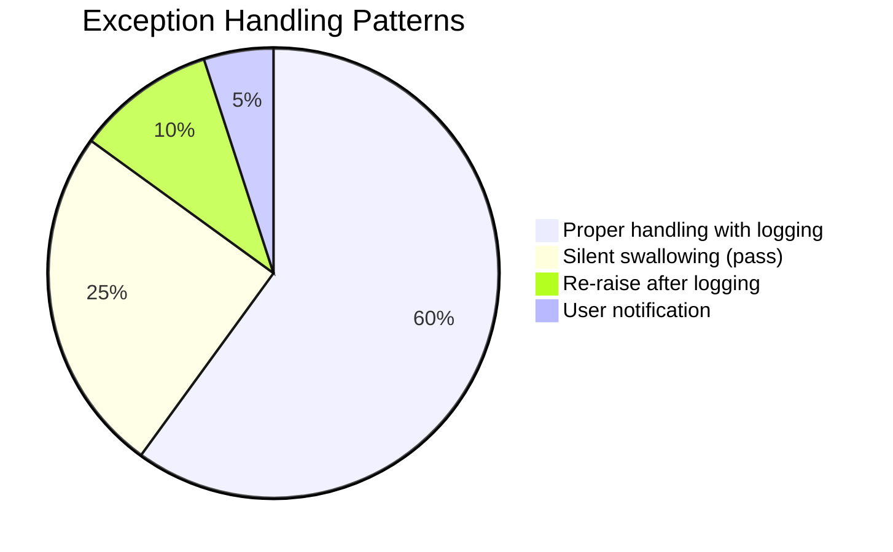
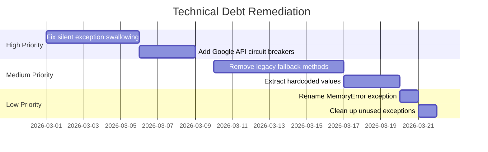
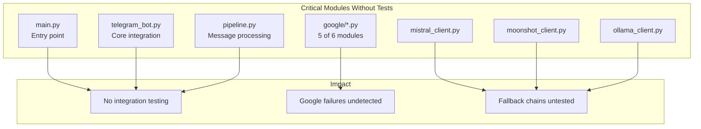
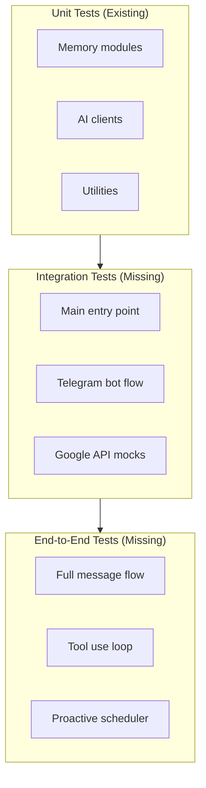
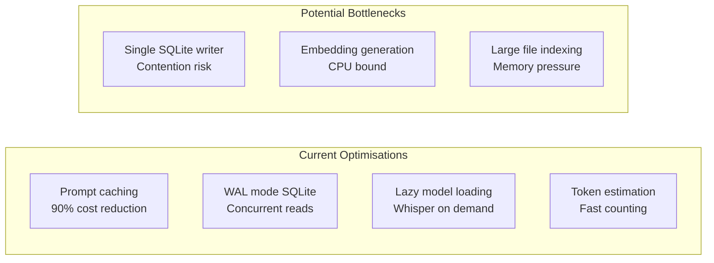
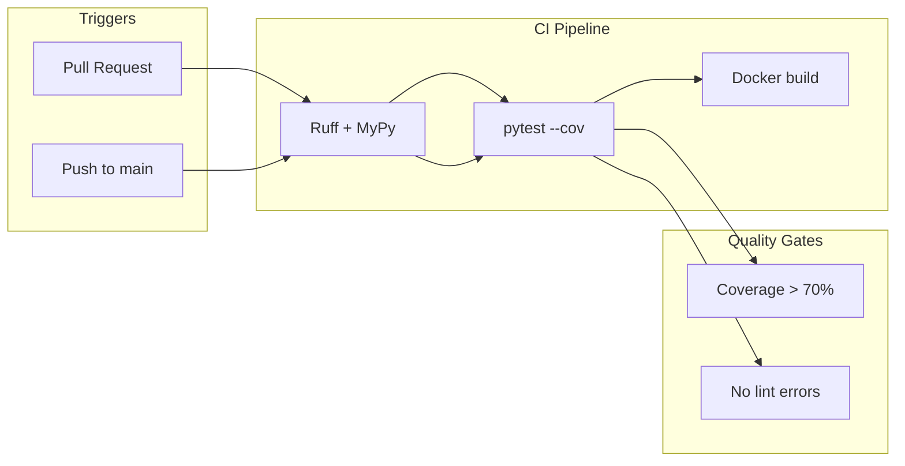
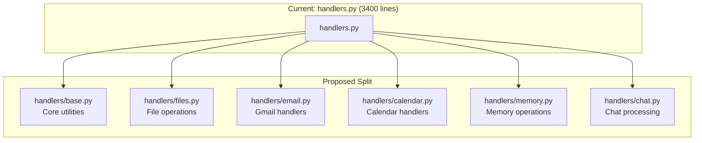

# Remy Engineering Review — March 2026

**Review Date:** 01/03/2026  
**Reviewer:** AI Engineering Review  
**Codebase Version:** Current HEAD (post-document image support)

---

## Executive Summary

Remy is a well-architected personal AI assistant with **73 Python modules** across 12 major subsystems. The codebase demonstrates strong architectural patterns including multi-model routing, circuit breakers, prompt caching, and crash-safe message delivery. However, the review identifies several areas requiring attention:

| Category | Status | Priority Items |
|----------|--------|----------------|
| Architecture | ✅ Strong | Cohesive design, clear separation of concerns |
| Code Quality | ⚠️ Mixed | 50+ hardcoded values, legacy code markers |
| Testing | ⚠️ Gaps | 44 test files, but 30+ modules lack coverage |
| Security | ✅ Good | Multi-layer validation, but Google APIs lack circuit breakers |
| Technical Debt | ⚠️ Moderate | 15+ legacy fallback methods, underutilised exceptions |

---

## 1. Codebase Structure & Organisation

### 1.1 Directory Structure

```
remy/
├── remy/                    # Main Python package (73 modules)
│   ├── ai/                  # AI clients and routing (9 modules)
│   ├── agents/              # Board of Directors sub-agents (8 modules)
│   ├── analytics/           # Metrics, costs, timing (6 modules)
│   ├── bot/                 # Telegram handlers and streaming (6 modules)
│   ├── delivery/            # Outbound message queue (2 modules)
│   ├── diagnostics/         # Health checks, error logging (3 modules)
│   ├── google/              # Google Workspace integrations (6 modules)
│   ├── hooks/               # Lifecycle hooks system (2 modules)
│   ├── memory/              # Database, embeddings, knowledge (13 modules)
│   ├── scheduler/           # Proactive messaging (1 module)
│   ├── utils/               # Formatting, circuit breakers (5 modules)
│   ├── voice/               # Whisper transcription (1 module)
│   └── web/                 # DuckDuckGo search (2 modules)
├── config/                  # Configuration files
├── data/                    # Runtime data (SQLite, logs, sessions)
├── docs/                    # Documentation (35+ user stories)
├── relay_mcp/               # Inter-agent MCP server
├── scripts/                 # Utility scripts
└── tests/                   # Test suite (44 files)
```

### 1.2 Naming Conventions

| Aspect | Assessment | Notes |
|--------|------------|-------|
| Module naming | ✅ Consistent | snake_case throughout |
| Class naming | ✅ Consistent | PascalCase (e.g., `ClaudeClient`, `ToolRegistry`) |
| Function naming | ✅ Consistent | snake_case with `_` prefix for private |
| File organisation | ✅ Good | Logical grouping by domain |

### 1.3 Identified Inconsistencies

| Issue | Location | Recommendation |
|-------|----------|----------------|
| Duplicate allowed directories | `handlers.py:74-78`, `tool_registry.py:119-123` | Extract to shared constant |
| Parallel handler implementations | Slash commands in `handlers.py` duplicate tool logic in `tool_registry.py` | Consider consolidating |
| Mixed import styles | Some files use relative, others absolute | Standardise on relative within package |

---

## 2. Architectural Completeness

### 2.1 High-Level Architecture



### 2.2 Data Flow Architecture



### 2.3 Architectural Gaps

| Gap | Impact | Recommendation |
|-----|--------|----------------|
| No CI/CD pipeline | Manual testing only | Add GitHub Actions workflow |
| Google APIs lack circuit breakers | Cascading failures possible | Extend `CircuitBreaker` to Google clients |
| No retry logic for Google APIs | Transient failures not handled | Add exponential backoff |
| Missing integration tests | `main.py`, `telegram_bot.py` untested | Add end-to-end test harness |
| No database migrations versioning | Manual migration tracking | Consider Alembic or version table |

### 2.4 Module Interaction Diagram



---

## 3. Code Quality & Practices

### 3.1 Coding Style Assessment

| Aspect | Status | Notes |
|--------|--------|-------|
| Type hints | ✅ Good | Consistent use of type annotations |
| Docstrings | ⚠️ Mixed | Present in most modules, some missing |
| Async patterns | ✅ Good | Proper async/await throughout |
| Error handling | ⚠️ Inconsistent | See Section 4.2 |

### 3.2 Code Duplication

| Duplication | Files | Recommendation |
|-------------|-------|----------------|
| Allowed base directories | `handlers.py`, `tool_registry.py` | Extract to `config.py` |
| Working messages list | `handlers.py:116-133`, `working_message.py` | Consolidate |
| Rate limiter instantiation | Multiple handlers | Use singleton pattern |
| Gmail body sanitisation | Multiple locations | Extract to utility function |

### 3.3 Hardcoded Values Requiring Configuration

| Category | Count | Examples |
|----------|-------|----------|
| Timeouts | 15+ | `30.0s` Telegram, `60.0s` Mistral, `120.0s` Moonshot |
| Limits | 20+ | `10` rate limit, `50000` chars, `5MB` document size |
| Intervals | 5+ | `300s` health check, `3600s` reindex |
| URLs/Hosts | 4 | `localhost:11434`, `0.0.0.0` bind addresses |

**Recommendation:** Move all hardcoded values to `config.py` with sensible defaults.

### 3.4 Large Files Requiring Refactoring

| File | Lines | Recommendation |
|------|-------|----------------|
| `handlers.py` | ~3,400 | Split by command category (file, email, calendar, etc.) |
| `tool_registry.py` | ~4,000 | Split schemas and executors into separate modules |
| `proactive.py` | ~900 | Extract briefing generators to separate module |

---

## 4. Mocks, Placeholders, and Technical Debt

### 4.1 Technical Debt Inventory

| Category | Items | Priority |
|----------|-------|----------|
| Legacy fallback methods | 15+ in `tool_registry.py` | Medium |
| Deprecated classifier | `_classify_heuristic` marked deprecated | Low |
| Unused custom exceptions | `MemoryError`, `SessionError`, `CancelledError` | Low |
| Silent exception swallowing | 25+ `except: pass` patterns | High |
| TODO comments | 8 references in docs | Low |

### 4.2 Exception Handling Issues



**Critical Issues:**

| Location | Issue | Impact |
|----------|-------|--------|
| `handlers.py:162` | Silent `except: pass` | Edit errors hidden |
| `conversations.py:108` | Corrupt lines skipped silently | Data loss undetected |
| `gmail.py:65` | Exception swallowed | API errors hidden |

### 4.3 Legacy Code Markers

| File | Line | Description |
|------|------|-------------|
| `main.py` | 201-202 | "legacy fallback during transition" |
| `database.py` | 248-250 | "backfill legacy facts/knowledge rows" |
| `knowledge.py` | 422 | `migrate_legacy_data` method |
| `tool_registry.py` | Multiple | 15+ "Legacy" fallback methods |

### 4.4 Technical Debt Remediation Plan



---

## 5. Testing & Validation

### 5.1 Test Coverage Summary

| Category | Modules | With Tests | Coverage |
|----------|---------|------------|----------|
| AI clients | 9 | 5 | 56% |
| Bot handlers | 6 | 4 | 67% |
| Memory | 13 | 11 | 85% |
| Google | 6 | 1 | 17% |
| Analytics | 6 | 3 | 50% |
| Agents | 8 | 2 | 25% |
| **Total** | **73** | **44** | **60%** |

### 5.2 Critical Coverage Gaps



### 5.3 Test Configuration

| Aspect | Status | Notes |
|--------|--------|-------|
| pytest.ini | ✅ Present | `asyncio_mode = auto` |
| conftest.py | ✅ Present | `tmp_data_dir`, `isolate_env` fixtures |
| Coverage reporting | ✅ Available | `make test-cov` |
| CI/CD | ❌ Missing | No automated pipeline |
| Load testing | ✅ Present | `tests/load/locustfile.py` |

### 5.4 Recommended Test Architecture



---

## 6. Security, Performance, and Scalability

### 6.1 Security Assessment

| Layer | Implementation | Status |
|-------|----------------|--------|
| Input validation | Length limits, pattern detection | ✅ Strong |
| Path traversal | Allowlist + denylist + resolution | ✅ Strong |
| SQL injection | Parameterised queries | ✅ Strong |
| Prompt injection | XML tag escaping | ✅ Good |
| Rate limiting | Per-user tracking | ✅ Good |
| Authentication | Telegram user allowlist | ✅ Good |
| API key protection | Redaction in logs | ✅ Good |

### 6.2 Security Gaps

| Gap | Risk | Recommendation |
|-----|------|----------------|
| Google APIs lack circuit breakers | Cascading failures | Extend `CircuitBreaker` |
| No request signing | Replay attacks | Consider HMAC for sensitive ops |
| Email content as untrusted | Prompt injection via email | Already documented, ensure consistent |

### 6.3 Performance Characteristics



### 6.4 Scalability Considerations

| Aspect | Current State | Limitation |
|--------|---------------|------------|
| Users | Single-user design | `telegram_allowed_users` allowlist |
| Database | SQLite | Single-writer, ~1TB practical limit |
| Embeddings | In-process | CPU-bound, no GPU acceleration |
| Sessions | JSONL files | File system I/O bound |

**Recommendation:** Current architecture is appropriate for personal assistant use case. Multi-user scaling would require PostgreSQL migration and distributed embedding service.

---

## 7. Recommendations

### 7.1 Priority Matrix

| Priority | Item | Effort | Impact |
|----------|------|--------|--------|
| **P0** | Add CI/CD pipeline | Medium | High |
| **P0** | Fix silent exception swallowing | Low | High |
| **P1** | Add Google API circuit breakers | Low | Medium |
| **P1** | Extract hardcoded values to config | Medium | Medium |
| **P1** | Add integration tests for `main.py` | Medium | High |
| **P2** | Split `handlers.py` into modules | High | Medium |
| **P2** | Remove legacy fallback methods | Medium | Low |
| **P2** | Add retry logic to Google APIs | Low | Medium |
| **P3** | Rename `MemoryError` exception | Low | Low |
| **P3** | Standardise error message format | Low | Low |

### 7.2 Proposed CI/CD Pipeline



### 7.3 Proposed Module Refactoring



### 7.4 Configuration Consolidation

```python
# Proposed additions to config.py

class Settings(BaseSettings):
    # Timeouts (currently hardcoded)
    telegram_timeout: float = 30.0
    mistral_timeout: float = 60.0
    moonshot_timeout: float = 120.0
    ollama_timeout: float = 120.0
    diagnostic_timeout: float = 10.0
    
    # Limits (currently hardcoded)
    rate_limit_per_minute: int = 10
    max_concurrent_per_user: int = 2
    max_document_size_bytes: int = 5_000_000
    telegram_max_message_length: int = 4000
    
    # Intervals (currently hardcoded)
    health_check_interval: int = 300
    reindex_interval: int = 3600
    
    # Allowed directories (currently duplicated)
    allowed_base_dirs: list[str] = [
        "~/Projects",
        "~/Documents", 
        "~/Downloads",
    ]
```

---

## 8. Appendices

### A. Module Inventory

| Module | Lines | Purpose | Test Coverage |
|--------|-------|---------|---------------|
| `handlers.py` | 3,403 | Telegram command handlers | Partial |
| `tool_registry.py` | 4,075 | Tool schemas and executors | Partial |
| `proactive.py` | 900 | Scheduled messaging | Yes |
| `database.py` | 464 | SQLite management | Yes |
| `claude_client.py` | 442 | Anthropic API client | Partial |
| `knowledge.py` | 450 | Unified memory store | Yes |
| `embeddings.py` | 305 | Vector embeddings | Yes |
| `router.py` | 224 | Model routing | Yes |
| `injector.py` | 350 | Memory context building | Yes |

### B. Known Bugs (from BUGS.md)

| Bug | Status | Priority |
|-----|--------|----------|
| ConversationStore missing `sessionsdir` | ✅ Fixed | High |
| Diagnostics import failure | ✅ Fixed | High |
| `set_proactive_chat` tool not working | ✅ Fixed | Medium |
| `/privacy-audit` invalid parameters | ✅ Fixed | Medium |
| Markdown rendering broken | ⬜ Open | Medium |
| Telegram transient disconnections | ⬜ Open | Medium |
| Scheduled job missed on startup | ⬜ Open | Medium |

### C. Dependency Analysis

**Core Dependencies (20 packages):**
- `anthropic` — Claude API client
- `python-telegram-bot` — Telegram integration
- `aiosqlite` — Async SQLite
- `sentence-transformers` — Embeddings
- `sqlite-vec` — Vector search
- `apscheduler` — Scheduling
- `pydantic-settings` — Configuration
- `google-api-python-client` — Google Workspace
- `httpx` — HTTP client
- `faster-whisper` — Voice transcription

**Security Note:** Dependency tree is minimal (~20 packages) compared to similar projects, reducing attack surface.

---

## 9. Conclusion

Remy demonstrates **strong architectural foundations** with clear separation of concerns, robust error handling patterns (circuit breakers, fallback chains), and comprehensive security measures. The codebase is well-organised and follows consistent naming conventions.

**Key Strengths:**
- Multi-model routing with intelligent fallback
- Prompt caching for 90% cost reduction
- Crash-safe message delivery queue
- Comprehensive input validation

**Priority Improvements:**
1. Add CI/CD pipeline for automated testing
2. Fix silent exception swallowing patterns
3. Extend circuit breakers to Google APIs
4. Add integration tests for core flows
5. Extract hardcoded values to configuration

The codebase is **production-ready for personal use** with the identified issues being maintainability and observability improvements rather than critical defects.

---

*Review generated: 01/03/2026*
