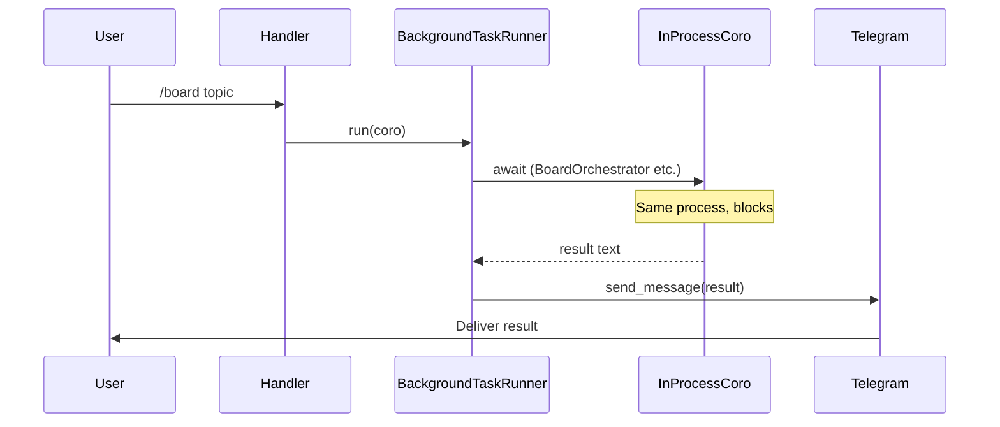
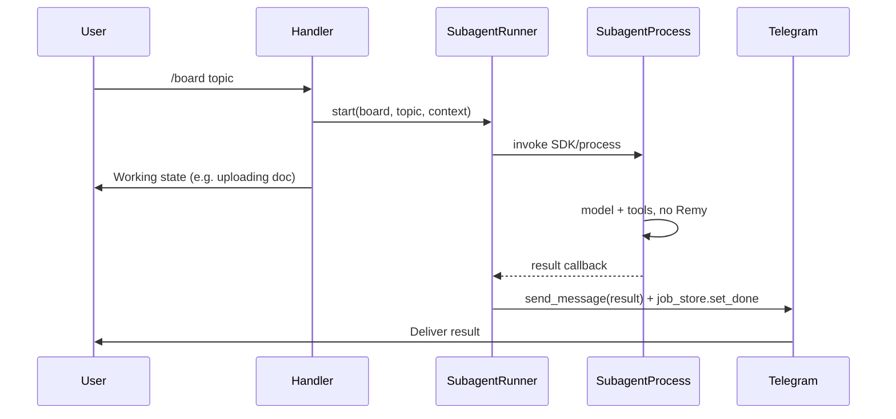

# Remy as UI Layer + Subagent Boundary

**Purpose:** Define the split between Remy (UI and routing only) and heavy work (subagents) so that all future work keeps Remy thin and routes long-running or multi-step AI tasks across a clear boundary.

See also: [remy-SAD.md](remy-SAD.md) (component diagram, data flow) and the principle in [TODO.md](../../TODO.md) ("Remy as UI layer, subagents for heavy work"). This doc is a short boundary spec and does not duplicate the full SAD.

---

## 1. Remy's responsibilities (UI layer only)

- **Telegram:** Receive messages, send replies, chat actions, inline keyboards, callbacks.
- **Relay:** Receive/post messages and notes for cowork/Desktop.
- **Routing:** Decide *which* task type (quick reply vs board vs research vs retrospective, etc.) and invoke the right path.
- **Delivery:** Show working state (e.g. "uploading document"), receive subagent result, send to user (and optionally persist to job store).
- **Session and identity:** `user_id`, `chat_id`, `thread_id`, `session_key`; pass into subagent context as needed.
- **No heavy AI logic:** No multi-step tool loops for board/research/retro, no orchestration of Board agents, no deep synthesis — that lives in subagents.

---

## 2. Subagent boundary

**What Remy sends:**

- Task type: e.g. `board` | `research` | `retrospective` | `reindex` | `consolidate`
- Input: topic, query, or empty as appropriate
- `user_id`, `chat_id`, `thread_id`
- Optional memory context (e.g. `<memory>...</memory>` for board)

**What subagents return:**

- Final text (or structured result) and optional status (done/failed).

**Contract:**

- Subagents are invoked asynchronously; Remy does not block on them.
- Remy gets a callback or polled result and then delivers to Telegram (+ job store if applicable).

**Current vs target flow:**

---

## 3. Current vs target (reference only)

**Current:**

Heavy work runs in-process via [remy/agents/background.py](../../remy/agents/background.py) (`BackgroundTaskRunner`) and direct calls to `BoardOrchestrator`, `ConversationAnalyzer.generate_retrospective`, etc. Handlers live in [remy/bot/handlers.py](../../remy/bot/handlers.py), [remy/bot/handlers/automations.py](../../remy/bot/handlers/automations.py), [remy/bot/handlers/web.py](../../remy/bot/handlers/web.py), [remy/bot/handlers/admin.py](../../remy/bot/handlers/admin.py), [remy/bot/handlers/memory.py](../../remy/bot/handlers/memory.py).

**Target:**

Same handlers, but they call a **subagent runner** (or SDK) with (task_type, input, user context). The runner starts the appropriate subagent (e.g. board-analyst, deep-researcher). Subagent runs with its own model and tools; when done, runner calls back into Remy to deliver the message (and update job store). Remy never runs `stream_with_tools` for board/research/retro — only for the interactive "quick-assistant" path.

---

## 4. Rules for new features

- **Quick:** Single tool call, short reply, or routing only → implement inside Remy (tools, handler, optional relay).
- **Heavy:** Long-running, multi-step AI, or distinct model/persona → design as a subagent task; Remy only routes and delivers.
