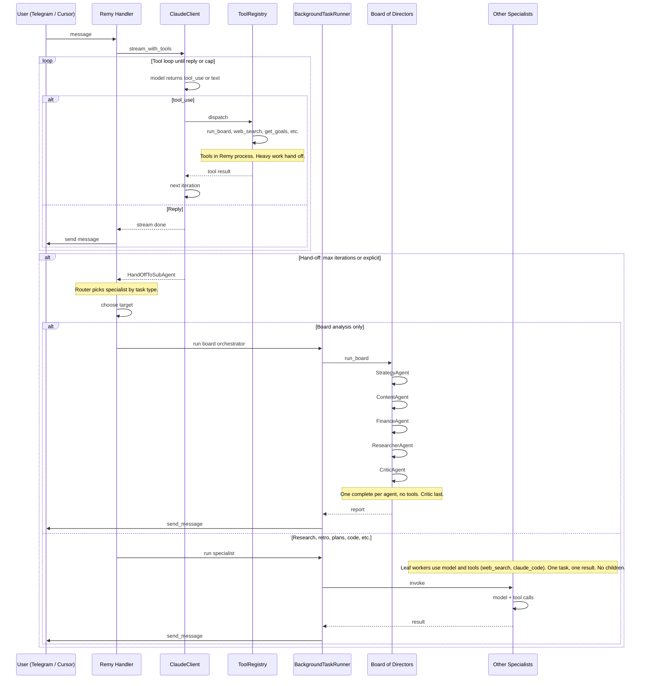

# Subagent Handoff: Behaviour and Testing

**Purpose:** Unpack how subagent handoff should work (from a conversation with Remy) and how to test it. Complements [remy-ui-and-subagent-boundary.md](remy-ui-and-subagent-boundary.md) and [US-subagents-next-plan.md](../backlog/US-subagents-next-plan.md).

**Principle:** The **Board of Directors** is a special-purpose sub-agent (strategic, multi-perspective analysis). It must not be used for generic "leg work" (e.g. bulk plan updates, data entry). Leg work should be routed to other specialists (plans-worker, researcher, code-reviewer, etc.).

---

## 1. What actually happened (conversation summary)

Remy was doing plan cleanup (abandon duplicates) via relay/Paperclip tools:

- **First attempt:** `list_plans` → `get_plan` (×2) → `update_plan_status` (×4). Hit **max tool iterations** (6) and was cut off; only 4 of 5 abandons completed.
- **After user said "yes" and Remy restarted:** `list_plans` again → `update_plan_status` (×5). All five went through in one turn.

So the work was done in two bites because of the iteration cap, not because of a bug. No subagents were involved — just the main agent hitting the cap and then finishing on the next turn.

Takeaways:

- The **iteration limit** is real and can truncate multi-step tool chains (e.g. many `update_plan_status` calls).
- **Intended behaviour (per user):** Remy should not rely on hitting that limit; instead, **hand off to a sub-agent** when a task would require many tool calls in sequence.
- **Intended architecture:** A **variety** of specialist sub-agents to hand to or create — not only the Board.

---

## 2. How subagent handoff works today

### 2.1 Trigger: max iterations

- **Config:** `anthropic_max_tool_iterations` (default **6**) in `remy/config.py`.
- **Code:** In `remy/ai/claude_client.py`, `stream_with_tools()` runs a loop over tool-use rounds. When the loop exits after `max_iterations` without `end_turn`:
  - It yields a truncation `TextChunk`: `"_Handing off to the Board to continue._"`
  - It yields `HandOffToSubAgent(topic=...)` where `topic` is derived from the last user message.

### 2.2 Consumer: Telegram handler

- In `remy/bot/handlers/chat.py`, when the stream yields `HandOffToSubAgent`:
  - `hand_off_requested = True`, `hand_off_topic = event.topic`.
  - After the reply is sent, the handler runs `_run_hand_off_board()` which calls:
    - `tool_registry.dispatch("run_board", {"topic": _topic}, _user_id)`.
  - So **the only hand-off target today is the Board** — no routing by task type.

### 2.3 Board as sub-agent

- `run_board` runs `BoardOrchestrator.run_board(topic)` (five sequential Board sub-agents: Strategy, Content, Finance, Researcher, Critic). So “sub-agent” in the hand-off path means “Board of Directors,” not the SAD v10 worker pool (ResearchAgent, GoalWorker, etc.) or Cursor `mcp_task` subagents.

---

## 3. How subagents *should* work (target)

- **No reliance on iteration cap:** When a task clearly needs many sequential tool calls (e.g. “abandon all duplicate plans”), Remy should **proactively hand off** to an appropriate specialist instead of chaining tools until the cap.
- **Variety of sub-agents:** Multiple specialists, e.g.:
  - **Board** — strategic/multi-perspective analysis (current hand-off target).
  - **Deep researcher** — web + files, long-running.
  - **Plans/Goals worker** — bulk plan/goal updates (e.g. abandon duplicates).
  - **Code / PR** — code review, repo operations.
  - **Finance** — budgeting, expenses, reports.
  - (Others as in TODO.md Phase 7 Step 3 and remy-ui-and-subagent-boundary.md.)
- **Remy’s role:** Route and deliver. Choose *which* sub-agent (or tool) fits the task; invoke it; surface result. Heavy or multi-step work lives in subagents, not in long tool chains in the main loop.
- **Cursor Remy:** In Cursor, “subagents” can also mean `mcp_task` (e.g. `explore`, `generalPurpose`, `shell`, `docs-researcher`). The same principle applies: when work is better done by a specialist, hand off instead of doing many tool calls in sequence.

---

## 4. Testing subagent handoff

### 4.1 Existing tests

- **`tests/test_tool_registry.py` — `test_stream_with_tools_hits_max_iterations_yields_truncation`**
  - Mocks `stream_with_tools` so that two iterations both return `tool_use` (no `end_turn`).
  - Asserts:
    - Exactly one `TextChunk` containing `"Handing off"`.
    - Exactly one `HandOffToSubAgent` with a non-empty `topic`.
  - This validates: **when the iteration cap is hit, the client yields truncation + hand-off event.**

- **`tests/test_tools/test_memory.py`** and **`tests/test_tool_registry.py`**
  - `exec_run_board` and `dispatch("run_board", ...)` are tested (topic passed, empty topic not run, etc.).
  - **Board execution** is covered; **chat handler** behaviour after `HandOffToSubAgent` is not unit-tested (it’s integration path).

### 4.2 Gaps

- **Handler:** No test that, when `HandOffToSubAgent` is received, the Telegram handler actually calls `dispatch("run_board", {"topic": ...})` (or in the future, the right sub-agent for the task).
- **Routing:** No test that different task types (or hints) result in different sub-agent targets — currently there is only one target (Board).
- **Proactive hand-off:** No test that the model (or a router) chooses to hand off *before* hitting the cap when the task is clearly multi-step (e.g. “abandon 10 plans”). That would require either:
  - A policy in the client (e.g. “after N tool calls, yield hand-off”), or
  - Model/schema guidance to emit a “hand off to X” tool call or event before the cap.

### 4.3 Recommended tests to add

1. **Chat handler hand-off**
   - In a test that drives the chat handler with a stream that yields `HandOffToSubAgent(topic="some topic")`, assert that `tool_registry.dispatch` is called with `"run_board"` and `{"topic": "some topic"}` (or the future equivalent for “chosen sub-agent”).
   - Ensures the event is wired to the only current hand-off target.

2. **Hand-off event shape**
   - Keep/extend `test_stream_with_tools_hits_max_iterations_yields_truncation`: assert `HandOffToSubAgent.topic` is the truncated last user text (or “Continue from previous turn” when empty). Documents the contract for consumers.

3. **Future: sub-agent routing**
   - When multiple hand-off targets exist, add tests that:
     - Given task type or metadata (e.g. “bulk plan updates” vs “strategic analysis”), the handler (or a small router) calls the correct sub-agent (e.g. plans-worker vs board).
     - Or that a “hand_off_to” tool call with `target: "board" | "research" | "plans"` is dispatched to the right runner.

4. **Future: proactive hand-off (optional)**
   - If we add a policy like “after N tool calls without end_turn, emit hand-off,” add a test that with N tool_use iterations the stream yields `HandOffToSubAgent` even if `max_iterations` is set higher (so hand-off is behaviour, not only cap).

### 4.4 Stepping through agent and tool calls in real life

To prove the agent loop and tool sequence work end-to-end:

- **Progressive scenario runner (iterative, recommended for remy-integration-tester):** From repo root, run `PYTHONPATH=. python3 scripts/run_integration_scenarios.py`. Runs Level 1→5 in order (single-tool → multi-tool → hand-off → sub-agent uses tools → run_board). Use in a loop: run → on failure log and fix → re-run until green. See `docs/architecture/integration-test-errors-and-fixes.md` and `.cursor/agents/remy-integration-tester.md`.
- **Trace script (real API):** From repo root, run `PYTHONPATH=. python3 scripts/trace_agent_sequence.py` or pass a prompt (e.g. "What time is it? Then list my goals."). Requires `ANTHROPIC_API_KEY` in `.env`. The script runs one message through `stream_with_tools` and prints every event (TextChunk, ToolStatusChunk, ToolResultChunk, ToolTurnComplete, HandOffToSubAgent) so you can step through the sequence.
- **Integration test (mocked API):** `pytest tests/test_tool_registry.py::test_stream_with_tools_sequence_trace_multi_tool_then_reply -v` mocks the stream to return tool_use then end_turn, records event order and dispatch calls, and asserts the sequence and that `dispatch("get_current_time", ...)` was called. No API cost; repeatable in CI.
- **Live session:** Run the bot and send a message in Telegram; tail logs with `LOG_LEVEL=DEBUG` to see stream_with_tools iteration and tool dispatch order.

---

## 5. Summary

| Aspect | Current | Target |
|--------|---------|--------|
| Trigger | Hit `anthropic_max_tool_iterations` (6) | Proactively hand off when task needs many steps; avoid relying on cap |
| Hand-off target | Always Board (`run_board`) | Variety: board, researcher, plans-worker, code, finance, etc. |
| Test coverage | Cap → truncation + `HandOffToSubAgent`; Board dispatch in isolation | Add: handler wires hand-off → dispatch; later: routing by task type and proactive hand-off |

The conversation showed that Remy can complete multi-step work in two turns when the cap cuts the first turn short. The desired direction is: **no iteration cap as the main lever; instead, hand off to the right sub-agent** and test both the hand-off event and the handler’s dispatch (and eventually routing).

---

## 6. Agent structure — sequence diagram

The diagram below shows how the whole agent structure fits together: Remy as the single entry and router, the tool loop, and when work is heavy or hits the iteration cap, routing to the **appropriate** specialist. The Board is used only for its special purpose (strategic Board analysis), not for leg work.

**Legend:**

- **Remy (Handler + Claude + ToolRegistry):** Single entry. Routes messages, runs the tool loop (model → tool_use → Registry.dispatch → result → next iteration), and when work is heavy or the iteration cap is hit, hands off to a specialist instead of chaining more tools.
- **Board of Directors (sub-agents):** Special-purpose; no tool calling. Each of the five agents (Strategy, Content, Finance, Researcher, Critic) is a **single Claude `complete()` call** with topic + prior thread + user context; no tools, no inner loop. The thread is passed along so each agent sees previous analyses; the Critic runs last and produces the verdict. Used only for explicit board analysis, **not** for leg work.
- **Other specialists (leaf workers):** Research, code, goal, retro, etc. These **do** use tools: e.g. ResearchAgent runs model + web_search and summarises; CodeAgent invokes `claude_code` (subprocess). They are "leaf" in the OpenClaw sense: one task in, one result out; they do **not** spawn child workers. Concurrency and depth limits are enforced when Remy (or an orchestrator) claims a slot via AgentTaskStore before starting the work.
- **BackgroundTaskRunner:** Fire-and-forget runner that executes a coroutine (board, research, retro, or future workers) and delivers the result to the user via Telegram.

---

## 7. OpenClaw-style sub-agent spawning and child depth — what’s implemented

The [OpenClaw architecture](OpenClaw_architecture.mmd) describes Depth 0 (main agent), Depth 1 (sub-agents, max 5 active), and Depth 2 (leaf workers that never spawn). SAD v10 §11 and [remy-sad-v10.md](remy-sad-v10.md) specify an orchestrator that spawns workers with bounded depth and concurrency.

### Implemented (spec + persistence + config)

| Piece | Where | Notes |
|--------|--------|--------|
| **Config** | `remy/config.py` | `subagent_max_workers=5`, `subagent_max_depth=2`, `subagent_max_children=3`, `subagent_stall_minutes=30`, `subagent_worker_model`, `subagent_synth_model` |
| **Schema** | `remy/memory/database.py` | `agent_tasks` table with `depth`, `parent_id`, `worker_type`, `status`, `surfaced_to_remy`; indexes for status and parent |
| **Orchestrator behaviour** | `config/TASK.example.md` | Coordination rules (max depth, max workers, stall threshold), synthesis rules, escalation (no auto-retry), model selection |
| **Heartbeat integration** | `remy/scheduler/heartbeat.py` | Queries `agent_tasks` for unsurfaced `done`/`failed`/`stalled`; injects `agent_tasks_context`; calls `mark_stalled_tasks(db)` so long-running tasks become `stalled`; marks `surfaced_to_remy=1` after delivery |
| **AgentTaskStore** | `remy/agents/agent_task_lifecycle.py` | `claim()` enforces max_workers/max_depth and inserts pending row; `wrap_coro()` marks running → done/failed; used by board handler before `BackgroundTaskRunner.run()` |
| **Worker modules** | `remy/agents/workers/` | `goal.py`, `code.py`, `research.py` (and base) exist; board is the first workload wired through AgentTaskStore + BackgroundTaskRunner |

### Implemented — limits and lifecycle (no separate runner)

- **AgentTaskStore** (`remy/agents/agent_task_lifecycle.py`): Claim slots (enforces `subagent_max_workers` and `subagent_max_depth`), persist to `agent_tasks`, and wrap coroutines so start/complete/fail are recorded. **No new runner class**: callers still use `BackgroundTaskRunner.run()` only; they optionally call `agent_task_store.claim()` and `wrap_coro()` before passing the coroutine to `BackgroundTaskRunner`. This keeps a single fire-and-forget primitive and avoids the duplicate SubagentRunner/TaskRunner that the consolidation review removed.- **Board command**: When `agent_task_store` is present, claims a slot before starting the board coroutine; if at limit, replies "Too many background tasks" and returns. Otherwise wraps the coroutine so the run is written to `agent_tasks` and surfaced by the heartbeat.
- **Stall marking** (`mark_stalled_tasks(db)` in heartbeat): Tasks in `running` longer than `subagent_stall_minutes` are set to `stalled` at the start of each heartbeat run so they appear in the unsurfaced query.

### Summary

- **Depth / concurrency:** Enforced at claim time in `AgentTaskStore.claim()`; `agent_tasks` stores `depth` and status.
- **Spawning:** Handlers (e.g. board) call `claim()` then `BackgroundTaskRunner.run(wrap_coro(...))` — one background primitive, book-keeping in `agent_tasks`.
- **No duplication:** BackgroundTaskRunner remains the only executor; AgentTaskStore is a lifecycle and limit layer used by the same handlers that already run background work.

---

## 8. Paperclip best practices — what’s implemented

From [paperclip-ideas.md](../paperclip-ideas.md). Below is what exists in code and config.

| Paperclip idea | Implementation |
|----------------|-----------------|
| **§5 Budget enforcement** | `remy/scheduler/heartbeat.py`: `check_budget()` uses `api_calls` to compute month-to-date spend vs `monthly_budget_aud` (config). Sets `budget_exhausted` at 100%; `budget_warning_pct` (default 80%) triggers a once-per-day warning via `enqueue_message`. |
| **§7 Auto-requeue stuck relay tasks** | `requeue_stuck_relay_tasks(db)`: selects relay `tasks` where `to_agent='remy'`, `status='in_progress'`, `updated_at` &gt; 30 min; updates to `status='pending'` with a note. Called at the start of each heartbeat run. |
| **§4 Approval gates (bulk / high-stakes)** | Gmail: `remy/ai/tools/email.py` uses `BULK_EMAIL_APPROVAL_THRESHOLD` (10). Above threshold, returns `APPROVAL_REQUIRED|token=...`; `remy/bot/handlers/chat.py` detects this and shows approval keyboard; `remy/bot/handlers/callbacks.py` implements Confirm/Cancel and `store_bulk_email_approval`. |
| **§9 Idempotency keys (cron)** | DB migration 018: `background_jobs.idempotency_key` + unique index. Prevents duplicate cron execution when the same job is enqueued twice. |
| **§1 Supersede-not-delete (knowledge)** | DB migration 017: `knowledge.superseded_by`. Facts/knowledge are superseded rather than hard-deleted. |
| **§6 Goal ancestry** | DB migration 019: `goals.parent_goal_id`. Nested goal hierarchy for “why” context. Plans link to goals via `goal_id`. |
| **§3 Formal heartbeat protocol (9-step)** | **CLAUDE.md**: Identity, Approvals, Assignments, Pick Work, Checkout, Context, Do Work, Update Status, Delegate. Relay tasks claimed via `relay_update_task`; conflict = skip, no retry. |
| **§4 Blocked-task deduplication** | **CLAUDE.md**: Before posting `needs_clarification`, check if Remy’s last message was already a clarification and cowork hasn’t replied; if so, skip re-posting. (Behaviour is in the protocol; no separate backend flag.) |
| **“Never silent on blocked”** | **CLAUDE.md**: Before setting `needs_clarification`, must update task notes, post message to cowork with a resolution option, and never leave `in_progress` without a comment. |
| **Messages vs tasks** | **CLAUDE.md**: Messages = FYIs/clarifications; tasks = authoritative work. Don’t use `relay_post_message` to create assignments; use `relay_update_task`. |
| **Session-end audit note** | **CLAUDE.md**: Post a session summary with `relay_post_note` (tasks completed, blocked, decisions). |
| **Decision documentation** | **CLAUDE.md**: Post notes for non-obvious judgment calls with `tags=["decision", ...]`. |
| **§L Outgoing webhooks** | DB migration 020: `webhook_subscriptions` table. `remy/webhooks.py` implements the outgoing webhook system. |

Not yet implemented (from the summary table): full PARA memory files, `qmd` CLI, board-member-style approval (single-user Remy uses inline Telegram approval only), and `relay_can_create_tasks` as a permission (config exists; relay task creation is gated by it).
