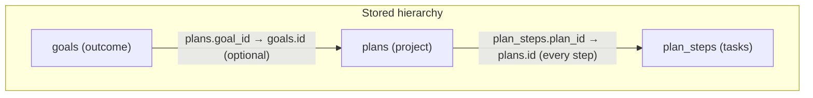

# User Story: Goal–Plan–Tasks Hierarchy for Executive Function

**Status:** ✅ Implemented

## Summary
As a user, I want a clear Goal → Plan → Steps hierarchy (and the ability to link plans to goals) so that Remy can help my executive function: I see which tasks belong to which plans and which plans serve which outcomes.

---

## Background

Goals and plans are currently separate systems. The `goals` table ([remy/memory/database.py](remy/memory/database.py)) holds a flat list of titles and descriptions; the `plans` table holds multi-step projects with `plan_steps` as children ([US-plan-tracking.md](US-plan-tracking.md)). There is no foreign key from `plans` to `goals`, so Remy cannot natively link a plan (e.g. "Fix laundry cupboard") to a goal (e.g. "Well-maintained home"). Steps already belong to a plan via `plan_steps.plan_id` — the link is stored when the plan is created, so Remy identifies "buy hinge" as belonging to "Fix laundry cupboard" because that step's row references that plan.

This story adds optional plan–goal linking and clearer semantic roles (goal = outcome, plan = project, steps = tasks) to support executive function: knowing which tasks sit under which plans and which plans serve which outcomes.

---

## Acceptance Criteria

1. **Optional plan–goal link.** A plan may be associated with at most one goal (nullable `goal_id` FK on `plans`). Create/update plan can set or clear it; list/get plan shows the linked goal when present.
2. **Goal phrasing guidance.** Remy prefers creating or refining goals as outcomes (e.g. "well-maintained home") rather than single tasks; doc or tool description captures this.
3. **Plan phrasing.** Plans are described as multi-step projects; steps remain the atomic actions (existing behaviour).
4. **Surfacing.** When listing goals, optionally show linked plans (and step progress); when listing plans, show linked goal title when set.
5. **Backward compatibility.** Existing plans without `goal_id` behave as today; no mandatory migration to attach goals.

---

## Implementation

**Files:** [remy/memory/database.py](remy/memory/database.py), [remy/memory/plans.py](remy/memory/plans.py), [remy/memory/goals.py](remy/memory/goals.py), [remy/ai/tools/plans.py](remy/ai/tools/plans.py), [remy/ai/tools/schemas.py](remy/ai/tools/schemas.py), [CLAUDE.md](CLAUDE.md) (or agent-facing doc).

### Hierarchy and identification

How Remy identifies what belongs to what: **steps** have `plan_id` (FK to plan), so "buy hinge" belongs to "Fix laundry cupboard" because that step's row references that plan. **Plans** optionally have `goal_id` (FK to goal) to link to an outcome.

- **Step → Plan:** Each row in `plan_steps` has `plan_id`. When you create a plan with steps, Remy inserts each step with that plan's id — so the link is in the DB, not inferred from text.
- **Plan → Goal:** Each row in `plans` may have `goal_id` pointing to a goal, so "Fix laundry cupboard" can be linked to "Well-maintained home".

### Schema

Add nullable `goal_id` to `plans` (FK to `goals.id`), via migration in `remy/memory/database.py`.

### Stores

- **PlanStore** ([remy/memory/plans.py](remy/memory/plans.py)): `create_plan` / update plan accept optional `goal_id`; `get_plan` / `list_plans` return goal info when present.
- **GoalStore** ([remy/memory/goals.py](remy/memory/goals.py)): optional method to list plans by `goal_id`, or extend list_goals response with plan count/summary.

### Tools

- [remy/ai/tools/plans.py](remy/ai/tools/plans.py) and plan schema in [remy/ai/tools/schemas.py](remy/ai/tools/schemas.py): add optional `goal_id` to create/update plan; describe in tool text that goals are outcomes and plans are projects under them.

### Guidance

Add a short "Goal vs plan" note to [CLAUDE.md](CLAUDE.md) or an agent-facing doc: goal = outcome, plan = project with steps, link when it helps executive function.

### Notes

- Depends on existing [US-plan-tracking.md](US-plan-tracking.md) and current goals/plans schema.
- No new Python dependencies.

---

## Test Cases

| Scenario | Expected |
|----------|----------|
| Create plan with `goal_id` | Plan appears under that goal in list; get_plan shows goal title. |
| Create plan without `goal_id` | Unchanged behaviour. |
| List goals | Active goals show linked plans (and step summary). |
| List plans | Plans show linked goal title when set. |
| Update plan to set/clear `goal_id` | Listing and get_plan reflect change. |
| Existing plans without `goal_id` | Continue to work as today. |

---

## Out of Scope

- Multiple goals per plan; DAG of goals; automatic creation of goals from plans.
- Changing inter-agent task system (not user goal/plan steps).
- Ad-hoc tasks that exist without a plan (steps remain always under a plan).
